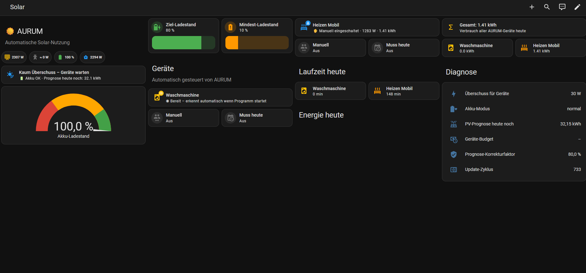
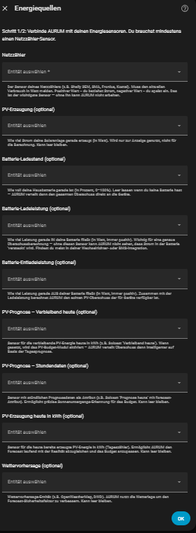
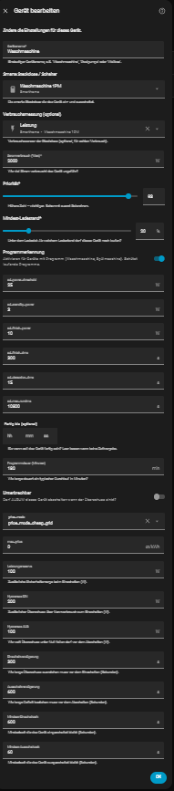

<p align="center">
  
</p>

<h3 align="center">Automatically route your PV surplus to household devices.<br>Zero YAML. Battery-aware. Forecast-smart. Price-aware.</h3>

<p align="center">
  <a href="https://github.com/hacs/integration"></a>
  <a href="https://github.com/cm-makes/aurum-ha/releases"></a>
  <a href="https://opensource.org/licenses/MIT"></a>
  <a href="https://www.home-assistant.io/"></a>
  <a href="https://github.com/cm-makes/aurum-ha/stargazers"></a>
</p>

<p align="center">
  <a href="https://www.buymeacoffee.com/cmmakes">
    
  </a>
  &nbsp;&nbsp;
  <a href="https://github.com/sponsors/cm-makes">
    
  </a>
</p>

---

**AURUM** (*Latin: Gold*) turns your solar surplus into gold: it automatically distributes excess PV power to household devices — priority-based, battery-aware, and fully configurable through the Home Assistant UI.

> **No coding required.** Install via HACS, add your grid sensor, configure devices through the UI — done.

<p align="center">
  
  <br>
  <em>Live dashboard with battery gauge, device states, runtimes, and diagnostics</em>
</p>

---

## Highlights

| Feature | Description |
|---|---|
| **PV Surplus Steering** | Turns devices on/off based on available excess power |
| **Battery-Aware** | Respects battery SOC with configurable target and minimum thresholds |
| **Priority-Based** | Higher priority devices get power first |
| **Startup Detection** | Detects washing machine / dishwasher program start, pauses until PV surplus is available, resumes automatically |
| **PV Forecast Budget** | Uses Solcast or Open-Meteo forecast to limit device runtime so the battery reliably reaches target SOC |
| **Price-Aware Scheduling** | Devices can run on cheap grid power (Tibber, Nordpool, aWATTar, EPEX Spot) — even without PV surplus |
| **Per-Device SOC Threshold** | Each device can have its own minimum battery level |
| **Energy Tracking** | Per-device kWh/day tracking, compatible with HA Energy Dashboard |
| **Push Notifications** | Optional mobile push when devices are turned on/off |
| **Manual Override & Must-run-today** | Auto-created switches per device for manual control and deadline forcing |
| **Hysteresis & Debounce** | Prevents rapid switching with configurable margins |
| **State Persistence** | Device runtimes, energy counters and budget safety factor survive restarts |
| **HA Diagnostics** | Download a full JSON snapshot for bug reports |
| **No Vendor Lock-In** | Works with any grid meter, any battery, any smart plug, any price sensor |

---

## Requirements

- Home Assistant 2024.1.0+
- A grid power sensor (W, signed: positive = import, negative = export) — e.g. Shelly 3EM, Kostal, SMA, Fronius
- Smart switches for your devices — e.g. Shelly Plug, Tasmota, Zigbee plugs
- Optional: Battery SOC sensor, PV power sensor, Solcast or Open-Meteo forecast

---

## Installation

### HACS (recommended)

1. Open HACS > Integrations > Custom repositories
2. Add `https://github.com/cm-makes/aurum-ha` as **Integration**
3. Search for "AURUM" and install
4. Restart Home Assistant

### Manual

1. Copy `custom_components/aurum/` to your `config/custom_components/` directory
2. Restart Home Assistant

---

## Setup

1. Go to **Settings > Integrations > Add Integration > AURUM**
2. **Energy & Battery:** Select your grid power sensor (and optionally PV, battery SOC, battery charge/discharge power, PV forecast)
3. **Battery settings:** Set capacity, target SOC, minimum SOC, and update interval
4. After setup: Go to **AURUM > Configure** to add devices

<p align="center">
  
  <br>
  <em>Setup wizard — connect your energy sensors in two steps</em>
</p>

### Adding Devices

In the integration options (Configure), click **Add a device** and fill in:

| Setting | Description |
|---------|-------------|
| **Name** | Display name (e.g. "Washing Machine") |
| **Switch entity** | The switch that controls the device |
| **Power sensor** | Optional: Real-time power measurement |
| **Nominal power** | Expected power draw in watts |
| **Priority** | 1–100, higher = turned on first |
| **SOC threshold** | Device only runs when battery is above this level |
| **Startup detection** | Enable for appliances with programs (washers, dishwashers). AURUM keeps the plug on in standby, detects when you press Start, pauses immediately, and resumes when PV surplus is sufficient. If a deadline is set and PV never arrives, AURUM starts on grid power as a fallback. |
| **Interruptible** | If disabled, AURUM will not turn the device off mid-cycle |
| **Deadline** | Time by which the device must have run (e.g. `18:00`) |
| **Estimated runtime** | Expected runtime in minutes (used for deadline scheduling) |

<p align="center">
  
  <br>
  <em>Device configuration — all settings via UI, no YAML needed</em>
</p>

### PV Forecast Budget (optional)

AURUM can limit device runtimes based on how much PV energy is forecast for the rest of the day, so the battery reliably reaches its target SOC.

In **Configure > Energy & Battery**:

| Field | What to enter |
|-------|---------------|
| `pv_forecast_entity` | Sensor with **remaining** forecast for today in kWh (e.g. Solcast "Prognose verbleibende Leistung heute") |
| `pv_forecast_today_entity` | Sensor with **hourly forecast data** as attribute (e.g. Solcast "Forecast Today" with `forecast` attribute) |

> If your forecast entity only provides a daily total without hourly data, AURUM uses a fallback sunset estimate (19:00) for budget calculations.

### Price-Aware Scheduling (optional)

AURUM can run devices on **cheap grid power** — even without PV surplus. Works with any electricity price sensor (Tibber, Nordpool, aWATTar, EPEX Spot, etc.).

**Step 1: Connect price sensors**

In **Configure > Energy & Battery**, set one or more of these:

| Field | What to enter | Example |
|-------|---------------|---------|
| `price_entity` | Current electricity price in ct/kWh | `sensor.tibber_aktueller_strompreis` |
| `price_level_entity` | Price level enum (very_cheap/cheap/normal/expensive/very_expensive) | `sensor.tibber_aktuelles_preisniveau` |
| `cheap_period_entity` | Binary sensor ON during cheap periods | `binary_sensor.tibber_bestpreis_zeitraum` |
| `cheap_period_starts_in_entity` | Minutes until next cheap period (for dashboard countdown) | `sensor.tibber_bestpreis_startet_in` |

> All fields are optional. You only need one price source — AURUM checks them in order: max_price threshold → cheap period → price level.

**Step 2: Configure devices**

Edit a device and set:

| Setting | Description |
|---------|-------------|
| **Price mode** | *Solar only* (default) or *Solar + cheap grid* |
| **Maximum price** | Grid power only below this price (ct/kWh). Set to 0 to use price level / cheap period instead. |

**How it works:**

A device with `cheap_grid` mode turns on when **any** of these is true:
1. PV surplus is sufficient (normal solar logic)
2. `max_price` is set and current price ≤ threshold
3. `cheap_period_entity` is ON (best price window active)
4. `price_level_entity` is `very_cheap` or `cheap`

Debounce timers still apply to prevent flapping on price edges.

**Works with:**
- [Tibber Prices](https://github.com/jpawlowski/hass.tibber_prices) — provides best price periods, countdown, price levels
- [Nordpool](https://github.com/custom-components/nordpool) — price sensor + price level
- [aWATTar](https://github.com/home-assistant-libs/awattar) — hourly price data
- [EPEX Spot](https://github.com/mampfes/hacs_epex_spot) — day-ahead prices
- Any sensor providing ct/kWh or price levels

---

## Real-World Results

Running on a 10 kWp system with 5 kWh battery, managing IR heaters, a washing machine, and a dishwasher — with typical spring sun, AURUM achieves **near-100% self-consumption** and **minimal grid import** during daylight hours. On cheap-tariff nights (Tibber), the heaters pre-heat rooms using low-cost grid power.

---

## How It Works

```
Every 15 seconds:
  1. Read grid power -> calculate excess (negative grid = export = surplus)
  2. Check battery SOC -> determine mode (normal / low_soc / charging)
  3. Optional: Calculate PV budget from forecast
  4. Optional: Read electricity price -> determine if cheap period active
  5. For each device (by priority):
     - Cheap grid mode + price OK? -> Turn ON (even without surplus)
     - Enough surplus + SOC OK + budget available? -> Turn ON
     - Surplus gone or SOC low? -> Turn OFF (respecting min-on-time)
  6. Startup Detection: If a washing machine starts -> protect the cycle
  7. Track energy (Wh) and runtime per device
```

### Battery Modes

| Mode | Condition | Effect |
|------|-----------|--------|
| **normal** | SOC >= target | All devices allowed |
| **low_soc** | min < SOC < target | Devices run if surplus is sufficient; per-device SOC thresholds apply |
| **charging** | SOC <= min | All devices off (battery protection) |

### Manual Override vs. Manually-On

| Situation | AURUM behavior |
|-----------|---------------|
| Override switch **ON** | AURUM ignores the device completely — no turn-on, no turn-off |
| Device physically on, override switch **OFF** | AURUM applies normal turn-off logic (e.g. battery protection) |
| AURUM turned the device on | Full management — turns off when surplus drops |

---

## Entities Created

### Global
| Entity | Type | Description |
|--------|------|-------------|
| `sensor.aurum_excess_power` | Sensor | Available surplus (W) |
| `sensor.aurum_grid_power` | Sensor | Grid power (W, positive = import) |
| `sensor.aurum_pv_power` | Sensor | PV production (W) |
| `sensor.aurum_house_consumption` | Sensor | House consumption (W) |
| `sensor.aurum_battery_soc` | Sensor | Battery SOC (%) |
| `sensor.aurum_battery_mode` | Sensor | Current mode (normal/low_soc/charging) |
| `sensor.aurum_battery_charge` | Sensor | Battery charge power (W) |
| `sensor.aurum_battery_discharge` | Sensor | Battery discharge power (W) |
| `sensor.aurum_electricity_price` | Sensor | Current electricity price (ct/kWh) with price_level, cheap_period, cheap_period_starts_in_min attributes |
| `sensor.aurum_forecast_remaining` | Sensor | PV forecast remaining today (kWh) |
| `sensor.aurum_budget` | Sensor | Device power budget (W) |
| `sensor.aurum_safety_factor` | Sensor | Budget safety factor (%) |
| `sensor.aurum_energy_today` | Sensor | Total energy all devices today (Wh) |
| `sensor.aurum_cycle` | Sensor | Update cycle counter (diagnostic) |
| `number.aurum_target_soc` | Number | Target SOC slider |
| `number.aurum_min_soc` | Number | Minimum SOC slider |

### Per Device
| Entity | Type | Description |
|--------|------|-------------|
| `sensor.aurum_{slug}` | Sensor | Device state (on/off/manual_override/running/standby/waiting/done). For cheap_grid devices: includes scheduling_reason, cheap_period, starts_in attributes |
| `sensor.aurum_{slug}_power` | Sensor | Current power draw (W) |
| `sensor.aurum_{slug}_runtime` | Sensor | Runtime today (min) |
| `sensor.aurum_{slug}_energy_today` | Sensor | Energy consumed today (Wh, TOTAL_INCREASING — HA Energy Dashboard compatible) |
| `binary_sensor.aurum_{slug}_active` | Binary | Is device active? |
| `number.aurum_{slug}_soc_threshold` | Number | SOC threshold slider |
| `switch.aurum_{slug}_override` | Switch | Manual override (AURUM hands off) |
| `switch.aurum_{slug}_muss_heute` | Switch | Force device on today |

> `{slug}` is the device name lowercased with spaces replaced by underscores (e.g. "Washing Machine" -> `washing_machine`).

---

## Example Dashboard

A ready-to-use Mushroom-based dashboard is included:

**[example_dashboard.yaml](example_dashboard.yaml)**

Copy the contents into **Settings > Dashboards > Raw configuration editor**.

> Requires [Mushroom Cards](https://github.com/piitaya/lovelace-mushroom) (installable via HACS)

---

## Diagnostics

Download a full JSON snapshot of AURUM's internal state for troubleshooting:

**Settings > Devices & Services > AURUM > Download Diagnostics**

The file contains: energy values, battery state, budget info, device states, override switch states, and coordinator health.

---

## Roadmap

- [x] Price-aware scheduling (Tibber, Nordpool, aWATTar, EPEX Spot)
- [x] Per-device energy tracking (kWh/day)
- [x] Push notifications (mobile app)
- [ ] Cost tracking (import/export/autarky per device)
- [ ] Multi-battery support
- [ ] Lovelace custom card for AURUM device overview

---

## Support the Project

If AURUM saves you energy and money, consider supporting its development:

<p align="center">
  <a href="https://www.buymeacoffee.com/cmmakes">
    
  </a>
</p>

<p align="center">
  <a href="https://github.com/sponsors/cm-makes">
    
  </a>
</p>

Your support helps keep this project alive and growing.

---

## Contributing

Contributions are welcome! See [CONTRIBUTING.md](CONTRIBUTING.md) for guidelines.

## License

MIT License — see [LICENSE](LICENSE)

## Changelog

See [CHANGELOG.md](CHANGELOG.md) for version history.
