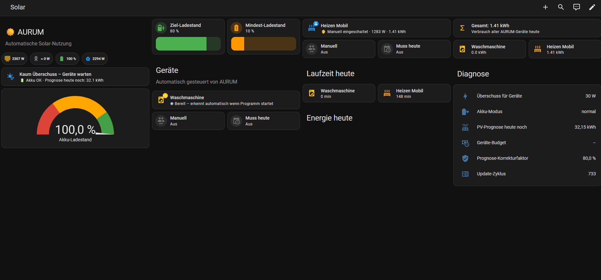
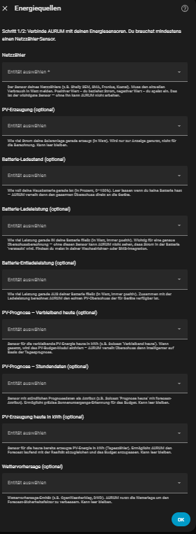
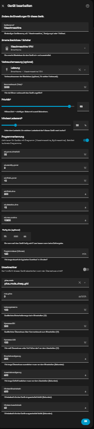

<p align="center">
  
</p>

<h3 align="center">Automatically route your PV surplus to household devices.<br>Zero YAML. Battery-aware. Forecast-smart. Price-aware.</h3>

<p align="center">
  <a href="https://hacs.xyz/"></a>
  <a href="https://github.com/cm-makes/aurum-ha/releases"></a>
  <a href="https://opensource.org/licenses/MIT"></a>
  <a href="https://www.home-assistant.io/"></a>
  <a href="https://github.com/cm-makes/aurum-ha/stargazers"></a>
</p>

<p align="center">
  <a href="https://www.buymeacoffee.com/cmmakes">
    
  </a>
  &nbsp;&nbsp;
  <a href="https://github.com/sponsors/cm-makes">
    
  </a>
</p>

---

**AURUM** (*Latin: Gold*) turns your solar surplus into gold: it automatically distributes excess PV power to household devices — priority-based, battery-aware, and fully configurable through the Home Assistant UI.

> **No coding required.** Install via HACS, add your grid sensor, configure devices through the UI — done.

<p align="center">
  
  <br>
  <em>Live dashboard with battery gauge, device states, runtimes, and diagnostics</em>
</p>

---

## Highlights

| Feature | Description |
|---|---|
| **Built-in Dashboard** | A self-adapting **AURUM** sidebar panel ships with the integration — no YAML, no extra cards. Add or remove a device and it updates automatically |
| **PV Surplus Steering** | Turns devices on/off based on available excess power |
| **Battery Priority** | Optional: only genuine grid export counts as surplus, so the battery charges first |
| **Battery-Aware** | Respects battery SOC with configurable target and minimum thresholds |
| **Run Conditions** | Optional per-device prerequisite (a sensor below/above a limit — e.g. water heater only while the tank is below 55 °C) |
| **PV Power Gate** | Optional per-device threshold: run on raw PV generation above a limit (with healthy SOC), bypassing the budget cap |
| **Daily Reset Hour** | Per-device reset hour for runtime counters — align a cheap-grid device to the solar day |
| **Priority-Based** | Higher priority devices get power first |
| **Startup Detection** | Detects washing machine / dishwasher program start, pauses until PV surplus is available, resumes automatically |
| **PV Forecast Budget** | Uses Solcast or Open-Meteo forecast to limit device runtime so the battery reliably reaches target SOC |
| **Price-Aware Scheduling** | Devices can run on cheap grid power (Tibber, Nordpool, aWATTar, EPEX Spot) — even without PV surplus |
| **Per-Device SOC Threshold** | Each device can have its own minimum battery level |
| **Energy Tracking** | Per-device kWh/day tracking, compatible with HA Energy Dashboard |
| **Push Notifications** | Optional mobile push when devices are turned on/off |
| **Manual Override & Must-run-today** | Auto-created switches per device for manual control and deadline forcing |
| **Hysteresis & Debounce** | Prevents rapid switching with configurable margins |
| **State Persistence** | Device runtimes, energy counters and budget safety factor survive restarts |
| **HA Diagnostics** | Download a full JSON snapshot for bug reports |
| **No Vendor Lock-In** | Works with any grid meter, any battery, any smart plug, any price sensor |

---

## Requirements

- Home Assistant 2024.1.0+
- A grid power sensor (W, signed: positive = import, negative = export) — e.g. Shelly 3EM, Kostal, SMA, Fronius
- Smart switches for your devices — e.g. Shelly Plug, Tasmota, Zigbee plugs
- Optional: Battery SOC sensor, PV power sensor, Solcast or Open-Meteo forecast

---

## Installation

### HACS (recommended)

1. Open HACS in Home Assistant
2. Search for **AURUM** and click **Download**
3. Restart Home Assistant

> **Until [HACS PR #6653](https://github.com/hacs/default/pull/6653) is merged**, AURUM isn't in the HACS default store yet. As a fallback: HACS → ⋮ → *Custom repositories* → add `https://github.com/cm-makes/aurum-ha` as **Integration**, then continue with step 2.

### Manual

1. Copy `custom_components/aurum/` to your `config/custom_components/` directory
2. Restart Home Assistant

---

## Setup

1. Go to **Settings > Integrations > Add Integration > AURUM**
2. **Energy & Battery:** Select your grid power sensor (and optionally PV, battery SOC, battery charge/discharge power, PV forecast)
3. **Battery settings:** Set capacity, target SOC, minimum SOC, and update interval
4. After setup: Go to **AURUM > Configure** to add devices

<p align="center">
  
  <br>
  <em>Setup wizard — connect your energy sensors in two steps</em>
</p>

### Adding Devices

In the integration options (Configure), click **Add a device** and fill in:

| Setting | Description |
|---------|-------------|
| **Name** | Display name (e.g. "Washing Machine") |
| **Switch entity** | The switch that controls the device |
| **Power sensor** | Optional: Real-time power measurement |
| **Nominal power** | Expected power draw in watts |
| **Priority** | 1–100, higher = turned on first |
| **SOC threshold** | Device only runs when battery is above this level |
| **Startup detection** | Enable for appliances with programs (washers, dishwashers). AURUM keeps the plug on in standby, detects when you press Start, pauses immediately, and resumes when PV surplus is sufficient. If a deadline is set and PV never arrives, AURUM starts on grid power as a fallback. |
| **Interruptible** | If disabled, AURUM will not turn the device off mid-cycle |
| **Deadline** | Time by which the device must have run (e.g. `18:00`) |
| **Estimated runtime** | Expected runtime in minutes (used for deadline scheduling) |
| **Run condition sensor** | Optional prerequisite: a sensor that must be **below** / **above** a limit for the device to run (e.g. water heater only while `sensor.boiler_temp` is below `55`). Blocks all start paths; an unavailable sensor fails open. |
| **Daily reset hour** | Hour (0–23) when this device's runtime counter resets. `0` = midnight (default). Set to `9` so a cheap-grid device runs on solar first during the day and only tops up its runtime from cheap grid overnight. |
| **PV power threshold** | Optional: run whenever *actual* PV generation is ≥ this many watts **and** battery SOC ≥ the device's SOC threshold, bypassing the daily budget cap. Expresses "run whenever PV ≥ 1000 W and battery ≥ 25 %" — useful when the surplus/budget logic reserves solar for the battery and a device (e.g. a pool pump) wouldn't otherwise start. Requires a PV **power** sensor. `0` = disabled (default). Also available as a live `number.aurum_{slug}_pv_power_threshold` entity and a dashboard control. |

> **Battery priority** (in *Configure → Energy & Battery*) is a global toggle:
> when enabled, only genuine grid **export** counts as surplus for devices, so
> the battery charges first. Off (default) keeps the previous behaviour where
> battery-charging power may be diverted to devices.

<p align="center">
  
  <br>
  <em>Device configuration — all settings via UI, no YAML needed</em>
</p>

### PV Forecast Budget (optional)

AURUM can limit device runtimes based on how much PV energy is forecast for the rest of the day, so the battery reliably reaches its target SOC.

In **Configure > Energy & Battery**:

| Field | What to enter |
|-------|---------------|
| `pv_forecast_entity` | Sensor with **remaining** forecast for today in kWh (e.g. Solcast "Prognose verbleibende Leistung heute") |
| `pv_forecast_today_entity` | Sensor with **hourly forecast data** as attribute (e.g. Solcast "Forecast Today" with `forecast` attribute) |

> If your forecast entity only provides a daily total without hourly data, AURUM uses a fallback sunset estimate (19:00) for budget calculations.

### Price-Aware Scheduling (optional)

AURUM can run devices on **cheap grid power** — even without PV surplus. Works with any electricity price sensor (Tibber, Nordpool, aWATTar, EPEX Spot, etc.).

**Step 1: Connect price sensors**

In **Configure > Energy & Battery**, set one or more of these:

| Field | What to enter | Example |
|-------|---------------|---------|
| `price_entity` | Current electricity price in ct/kWh | `sensor.tibber_aktueller_strompreis` |
| `price_level_entity` | Price level enum (very_cheap/cheap/normal/expensive/very_expensive) | `sensor.tibber_aktuelles_preisniveau` |
| `cheap_period_entity` | Binary sensor ON during cheap periods | `binary_sensor.tibber_bestpreis_zeitraum` |
| `cheap_period_starts_in_entity` | Minutes until next cheap period (for dashboard countdown) | `sensor.tibber_bestpreis_startet_in` |

> All fields are optional. You only need one price source — AURUM checks them in order: max_price threshold → cheap period → price level.

**Step 2: Configure devices**

Edit a device and set:

| Setting | Description |
|---------|-------------|
| **Price mode** | *Solar only* (default), *Solar + cheap grid*, or *Solar + cheap grid (SOC-gated)* |
| **Maximum price** | Grid power only below this price (ct/kWh). Set to 0 to use price level / cheap period instead. |

**How it works:**

A device with `cheap_grid` mode turns on when **any** of these is true:
1. PV surplus is sufficient (normal solar logic)
2. `max_price` is set and current price ≤ threshold
3. `cheap_period_entity` is ON (best price window active)
4. `price_level_entity` is `very_cheap` or `cheap`

Debounce timers still apply to prevent flapping on price edges.

A price-based start (2–4) is independent of the daily PV budget: the budget
reserves *solar* for battery charging, and a cheap-grid run uses grid, so an
exhausted budget — including the always-zero budget after sunset — never
blocks it. (Before 1.15.1 it did, unless the device's own `soc_threshold`
happened to be above the current SOC.)

**`cheap_grid` vs. `cheap_grid_soc`:** in plain `cheap_grid`, conditions 2–4
start the device regardless of battery SOC — the device's `soc_threshold` is
never consulted on the price path. That is the right behaviour for a load
that should always take cheap grid power (a water heater, say), but it means
a device can run on grid all night while the battery sits below the reserve
you configured for it.

`cheap_grid_soc` behaves identically **except** that the price-based start is
only granted while battery SOC is at or above that device's `soc_threshold`.
Below the threshold the device falls back to solar-only behaviour: genuine PV
surplus (grid export) can still run it, a cheap price alone cannot. Set a
device to `cheap_grid_soc` when you want price-awareness *and* a battery
floor; leave it on `cheap_grid` when price should always win.

**Works with:**
- [Tibber Prices](https://github.com/jpawlowski/hass.tibber_prices) — provides best price periods, countdown, price levels
- [Nordpool](https://github.com/custom-components/nordpool) — price sensor + price level
- [aWATTar](https://github.com/home-assistant-libs/awattar) — hourly price data
- [EPEX Spot](https://github.com/mampfes/hacs_epex_spot) — day-ahead prices
- Any sensor providing ct/kWh or price levels

---

## Real-World Results

Running on a 10 kWp system with 5 kWh battery, managing IR heaters, a washing machine, and a dishwasher — with typical spring sun, AURUM achieves **near-100% self-consumption** and **minimal grid import** during daylight hours. On cheap-tariff nights (Tibber), the heaters pre-heat rooms using low-cost grid power.

---

## How It Works

```
Every 15 seconds:
  1. Read grid power -> calculate excess (negative grid = export = surplus)
  2. Check battery SOC -> determine mode (normal / low_soc / charging)
  3. Optional: Calculate PV budget from forecast
  4. Optional: Read electricity price -> determine if cheap period active
  5. For each device (by priority):
     - Cheap grid mode + price OK? -> Turn ON (even without surplus)
       (cheap_grid_soc: only while SOC >= the device soc_threshold)
     - Enough surplus + SOC OK + budget available? -> Turn ON
     - Surplus gone or SOC low? -> Turn OFF (respecting min-on-time)
  6. Startup Detection: If a washing machine starts -> protect the cycle
  7. Track energy (Wh) and runtime per device
```

### Battery Modes

| Mode | Condition | Effect |
|------|-----------|--------|
| **normal** | SOC >= target | All devices allowed |
| **low_soc** | min < SOC < target | Devices run if surplus is sufficient; per-device SOC thresholds apply |
| **charging** | SOC <= min | All devices off (battery protection) |

### Manual Override vs. Manually-On

| Situation | AURUM behavior |
|-----------|---------------|
| Override switch **ON** | AURUM ignores the device completely — no turn-on, no turn-off |
| Device physically on, override switch **OFF** | AURUM applies normal turn-off logic (e.g. battery protection) |
| AURUM turned the device on | Full management — turns off when surplus drops |

---

## Entities Created

### Global
| Entity | Type | Description |
|--------|------|-------------|
| `sensor.aurum_excess_power` | Sensor | Available surplus (W) |
| `sensor.aurum_grid_power` | Sensor | Grid power (W, positive = import) |
| `sensor.aurum_pv_power` | Sensor | PV production (W) |
| `sensor.aurum_house_consumption` | Sensor | House consumption (W) |
| `sensor.aurum_battery_soc` | Sensor | Battery SOC (%) |
| `sensor.aurum_battery_mode` | Sensor | Current mode (normal/low_soc/charging) |
| `sensor.aurum_battery_charge` | Sensor | Battery charge power (W) |
| `sensor.aurum_battery_discharge` | Sensor | Battery discharge power (W) |
| `sensor.aurum_electricity_price` | Sensor | Current electricity price (ct/kWh) with price_level, cheap_period, cheap_period_starts_in_min attributes |
| `sensor.aurum_forecast_remaining` | Sensor | PV forecast remaining today (kWh) |
| `sensor.aurum_budget` | Sensor | Device power budget (W) |
| `sensor.aurum_safety_factor` | Sensor | Budget safety factor (%) |
| `sensor.aurum_energy_today` | Sensor | Total energy all devices today (Wh) |
| `sensor.aurum_current_decision` | Sensor | What AURUM is doing right now, and why — see [The Advisor](#the-advisor-current-decision) |
| `sensor.aurum_cycle` | Sensor | Update cycle counter (diagnostic) |
| `number.aurum_target_soc` | Number | Target SOC slider |
| `number.aurum_min_soc` | Number | Minimum SOC slider |

### Per Device
| Entity | Type | Description |
|--------|------|-------------|
| `sensor.aurum_{slug}` | Sensor | Device state (on/off/manual_override/running/standby/waiting/done). For price-aware devices (cheap_grid, cheap_grid_soc): includes scheduling_reason, price_mode, cheap_period, starts_in attributes |
| `sensor.aurum_{slug}_power` | Sensor | Current power draw (W) |
| `sensor.aurum_{slug}_runtime` | Sensor | Runtime today (min) |
| `sensor.aurum_{slug}_energy_today` | Sensor | Energy consumed today (Wh, TOTAL_INCREASING — HA Energy Dashboard compatible) |
| `binary_sensor.aurum_{slug}_active` | Binary | Is device active? |
| `number.aurum_{slug}_soc_threshold` | Number | SOC threshold slider |
| `switch.aurum_{slug}_override` | Switch | Manual override (AURUM hands off) |
| `switch.aurum_{slug}_muss_heute` | Switch | Force device on today |
| `switch.aurum_{slug}_disable` | Switch | Force-off: removes the device from control and keeps it off |

> `{slug}` is the device name lowercased with spaces replaced by underscores (e.g. "Washing Machine" -> `washing_machine`).

---

## Dashboard

AURUM ships with its own **dashboard panel** — nothing to install or configure.
After setup, an **AURUM** entry (☀️) appears in the Home Assistant sidebar. It
renders live from AURUM's own entities and adapts automatically: add or remove a
device in the options and its card appears or disappears.

It shows a **decision banner** up top (what AURUM is doing right now — see
[The Advisor](#the-advisor-current-decision)), overview chips (PV, grid
import/export, battery SOC, surplus, budget, house consumption, remaining
forecast, cheap-grid flag) and one card per device with a **PV | Manual | Off**
mode selector, a *Must-run-today* toggle, a translated reason line ("→ solar
surplus", "→ waiting for program start"), and the SOC-threshold, max-price,
PV-power-threshold and deadline controls. It follows your HA theme and is
localized (English by default, German when the HA UI is set to German).

> The sidebar entry is sorted alphabetically — if your sidebar is long, scroll
> down or pin it to the top via *Profile → Edit sidebar*.

**Optional (legacy):** a manual Mushroom-based dashboard is still available as
**[example_dashboard.yaml](example_dashboard.yaml)** for users who prefer a
Lovelace dashboard (requires [Mushroom Cards](https://github.com/piitaya/lovelace-mushroom) via HACS).

---

## The Advisor: Current Decision

`sensor.aurum_current_decision` answers the most common question about any
automatic optimizer: **"Why is AURUM (not) running my device right now?"**
Zero configuration — it's always active.

### Sensor state (localized EN/DE)

| Code | Meaning |
|------|---------|
| `running_solar` | At least one device is running on PV surplus |
| `running_cheap_grid` | Running because electricity is cheap |
| `running` | Running for another reason (manual override, deadline) |
| `waiting` | Devices configured, none running — waiting for surplus |
| `battery_charging` | Battery below your `min_soc` reserve — devices paused |
| `startup` | Sensor warm-up after a restart (~90 s) |
| `idle` | No devices configured |

### Per-device reasons (attributes)

The `devices` attribute lists every device with a machine-readable `reason`:

| Reason | Meaning |
|--------|---------|
| `solar_surplus` | Running on PV surplus |
| `solar_pv` | Running via the raw-PV gate (`pv_power_threshold`) |
| `cheap_grid` | Running on cheap grid power |
| `manual_override` | You took over — AURUM hands off |
| `forced_deadline` | Deadline start (must finish today) |
| `runtime_done` / `program_done` | Done for today |
| `program_standby` | Waiting for you to start a program (washer/dishwasher) |
| `program_paused` | Program paused, waiting for surplus to resume |
| `battery_charging` | Battery below reserve |
| `below_soc_threshold` | Battery below this device's SOC threshold |
| `condition_not_met` | Run condition blocks it (e.g. boiler already hot) |
| `disabled` | Force-off switch is on |
| `waiting_surplus` | Not enough surplus right now |

> Reason codes in attributes are untranslated by design (HA only translates
> entity states). The AURUM panel shows them translated; in your own cards
> you see the codes.

### Use it in your own dashboard

```yaml
type: markdown
content: >
  ## {{ states('sensor.aurum_current_decision') }}
  
  - **{{ d.name }}**: {{ d.state }} → {{ d.reason }}
  
```

### Use it in automations

```yaml
# Push notification when the battery drops below reserve
trigger:
  - platform: state
    entity_id: sensor.aurum_current_decision
    to: battery_charging

# Condition: has the washing machine finished its program today?
condition: >
  {{ state_attr('sensor.aurum_current_decision', 'devices')
     | selectattr('slug', 'eq', 'washing_machine')
     | map(attribute='reason') | first == 'program_done' }}
```

The attributes deliberately contain no fast-changing numbers (no watts, no
timestamps), so the sensor produces clean state history and won't bloat your
recorder database. Live power values live in the dedicated numeric sensors.

---

## Diagnostics

Download a full JSON snapshot of AURUM's internal state for troubleshooting:

**Settings > Devices & Services > AURUM > Download Diagnostics**

The file contains: energy values, battery state, budget info, device states, override switch states, and coordinator health.

---

## Roadmap

- [x] Price-aware scheduling (Tibber, Nordpool, aWATTar, EPEX Spot)
- [x] Per-device energy tracking (kWh/day)
- [x] Push notifications (mobile app)
- [x] Built-in dashboard panel (auto-adapting AURUM sidebar view)
- [x] Battery-priority surplus mode
- [x] Per-device run conditions (sensor prerequisite)
- [x] Per-device daily reset hour
- [ ] Cost tracking (import/export/autarky per device)
- [ ] Multi-battery support

---

## Support the Project

If AURUM saves you energy and money, consider supporting its development:

<p align="center">
  <a href="https://www.buymeacoffee.com/cmmakes">
    
  </a>
</p>

<p align="center">
  <a href="https://github.com/sponsors/cm-makes">
    
  </a>
</p>

Your support helps keep this project alive and growing.

---

## Troubleshooting

### Start here: ask AURUM what it's doing

Before working through the symptoms below, look at **`sensor.aurum_current_decision`** — or the banner at the top of the AURUM panel. It answers *"why is (not) this device running right now?"* for every device, in plain language, with no configuration:

```
Waiting for surplus · 0/3 active
  Pool pump      → below battery threshold
  Water heater   → waiting for surplus
  Dishwasher     → waiting for program start
```

Most "it doesn't work" reports turn out to be AURUM working correctly and saying so — a battery below the device threshold, a run condition that isn't met, a daily runtime already used up. See [The Advisor](#the-advisor-current-decision) for every reason code and what it means.

If the decision genuinely doesn't match what you expected, that's worth an [issue](https://github.com/cm-makes/aurum-ha/issues) — include the sensor's attributes and we can see exactly what AURUM saw.

### Then check these patterns

Most remaining setup issues fall into one of these. Before opening an issue, check whether your symptom matches.

### `sensor.aurum_excess_power` is always 0 (or always huge) — devices never react

**Grid sign convention is wrong.** AURUM expects: positive grid power = drawing from grid, negative = feeding in. Many inverters report this the other way around (or only positive values).

Quick test: with PV producing more than house consumption, your grid sensor should read **negative**. If it's positive while you're exporting, create a Template sensor that flips the sign:

```yaml
template:
  - sensor:
      - name: "Grid Power Signed"
        unit_of_measurement: "W"
        device_class: power
        state_class: measurement
        state: "{{ -1 * states('sensor.your_grid_sensor') | float(0) }}"
```

Then point AURUM at `sensor.grid_power_signed`.

### Battery mode stuck on `charging`, all devices off

Two possible causes:

1. **Battery SOC sensor below `min_soc`** — check `sensor.aurum_battery_soc` vs. the **Battery reserve** slider. If SOC is reported as e.g. `42` but you expected `42%`, you're fine. If it's `0.42`, your sensor reports a fraction — AURUM's config flow now catches this at setup, but old configs won't be re-validated. Replace with a Template sensor that multiplies by 100.
2. **No battery configured, but `min_soc` > 0** — without a battery SOC sensor, AURUM treats SOC as 0 and goes straight into charging mode. Leave the battery SOC empty *and* set `min_soc` to 0.

### Surplus seems too low when the sun is bright

You probably have a battery but didn't configure **Battery charge power** and **Battery discharge power**. Without these, AURUM can't tell how much PV power is "hidden" in battery charging, so it underestimates the real surplus available for devices. Both sensors live in your inverter/BMS integration (Solax, SMA, Fronius, Kostal usually expose them).

### Device shows as `waiting` even though there's surplus

Open the device entity and check:

- **Priority** — lower-priority devices wait while higher-priority ones get power first
- **SOC threshold** — device won't run if battery is below this level (during `low_soc` mode)
- **Hysteresis ON** — AURUM needs `nominal_power + hysteresis_on` of surplus before turning on, to avoid flapping
- **Debounce ON** — surplus must stay sufficient for this many seconds before AURUM commits

For diagnostic detail, look at the device entity's `scheduling_reason` attribute.

### Devices keep flapping (on/off/on/off)

Increase `hysteresis_off` (tolerate larger surplus dips before turning off) and `debounce_off` (let the device ride through short clouds). Defaults are 100W / 600s — for shaded sites, try 200W / 900s.

### Still stuck?

Download diagnostics (**Settings → Devices & Services → AURUM → ⋮ → Download diagnostics**) and open an issue with that file attached. It contains every value the maintainer needs to debug.

---

## Support & Community

Got a question, an idea, or want to show off your setup? Use GitHub Discussions — it's the fastest way to get help and talk to other users.

| | |
|---|---|
| [Ask a question](https://github.com/cm-makes/aurum-ha/discussions/categories/q-a) | Setup help, configuration, troubleshooting |
| [Share an idea](https://github.com/cm-makes/aurum-ha/discussions/categories/ideas) | Feature ideas — discuss before opening a formal request |
| [Show and tell](https://github.com/cm-makes/aurum-ha/discussions/categories/show-and-tell) | Dashboards, setups, energy results |
| [Report a bug](https://github.com/cm-makes/aurum-ha/issues/new?template=bug_report.yml) | Something broken? Open an issue |

---

## Contributing

Contributions are welcome! See [CONTRIBUTING.md](CONTRIBUTING.md) for guidelines.

## License

MIT License — see [LICENSE](LICENSE)

## Changelog

See [CHANGELOG.md](CHANGELOG.md) for version history.
